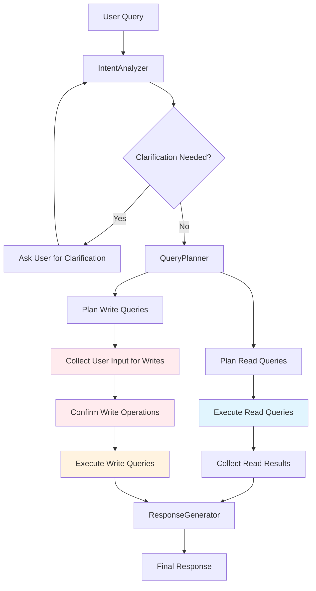
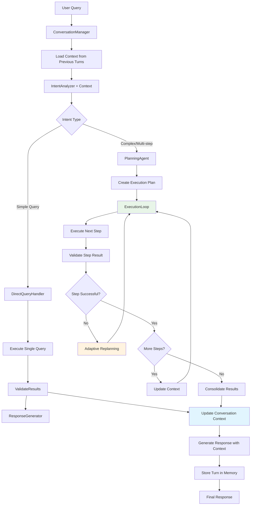

# Chat Service Flow Analysis & Recommendations

## Overview

This document analyzes the current chat service architecture and provides recommendations for improvement. The current system is in development phase with debugging features enabled, including manual confirmations for all operations to help with development and testing.

## Current Chat Service Flow Analysis

### Current Architecture Diagram



### Current Issues Identified

#### 1. **Disjointed Write Flow** =4
- **Problem**: Write operations require manual parameter collection mid-execution
- **Code Evidence**: Lines 169-180 in `chat_service.rb` show interactive prompting for parameters
- **Impact**: Breaks conversational flow, requires multiple user interactions

#### 2. **Rigid Two-Phase Processing** =4
- **Problem**: Reads and writes are completely separate phases
- **Code Evidence**: Lines 24-31 in `query_planner.rb` show sequential planning
- **Impact**: Can't adapt writes based on read results effectively

#### 3. **Complex ID Management** =4
- **Problem**: Brittle elementId parsing and verification
- **Code Evidence**: Lines 220-241 in `chat_service.rb` show regex parsing of queries
- **Impact**: Fragile, error-prone, hard to debug

#### 4. **Debugging Confirmations** 🟡
- **Current State**: Read/write confirmations are temporary for debugging and development
- **Code Evidence**: Lines 202-203 require manual approval for each operation
- **Purpose**: Allows developer to see and verify generated queries during development
- **Future Direction**: Write confirmations will remain for safety, but without exposing raw queries

#### 5. **No Context Persistence** =�
- **Problem**: No conversation memory or context accumulation
- **Impact**: Each query starts from scratch, can't build on previous interactions

## Recommended Improved Architecture

### Enhanced Flow Diagram



### Key Improvements

#### 1. **Planning-Acting-Observing Loop** =�
```ruby
class ChatExecutionLoop
  def execute_plan(plan, context)
    plan.steps.each do |step|
      result = execute_step(step, context)
      
      if result.success?
        context.add_result(step, result)
      else
        # Adaptive replanning based on failure
        plan = replan_from_failure(step, result, context)
        redo
      end
    end
  end
end
```

#### 2. **Conversation Context Management** =�
```ruby
class ConversationContext
  attr_reader :turns, :entities_mentioned, :active_objects
  
  def add_turn(query, intent, results)
    @turns << { query: query, intent: intent, results: results, timestamp: Time.current }
    extract_entities_and_update_active_set(results)
  end
  
  def get_relevant_context(current_intent)
    # Return contextually relevant information from previous turns
  end
end
```

#### 3. **Unified Query Execution** =�
```ruby
class UnifiedQueryExecutor
  def execute(query_spec, context)
    case query_spec.type
    when :read
      execute_read_query(query_spec, context)
    when :write
      execute_write_with_validation(query_spec, context)
    when :create
      execute_create_with_relationships(query_spec, context)
    end
  end
  
  private
  
  def execute_write_with_validation(query_spec, context)
    # Validate against schema
    # Pre-populate parameters from context
    # Execute with proper error handling
    # Validate results
  end
end
```

#### 4. **Smart Parameter Resolution** =�
```ruby
class ParameterResolver
  def resolve(query_spec, context, intent)
    params = {}
    
    query_spec.required_params.each do |param|
      params[param] = resolve_parameter(param, context, intent)
    end
    
    params
  end
  
  private
  
  def resolve_parameter(param, context, intent)
    # Try to get from intent
    return intent.dig("properties", param) if intent.dig("properties", param)
    
    # Try to get from conversation context
    return context.get_active_entity_property(param) if context.has_active_entity?
    
    # Try to infer from previous results
    return infer_from_results(param, context.recent_results)
    
    # Last resort: ask user
    prompt_user_for_parameter(param)
  end
end
```

### Implementation Recommendations

#### 1. **Refactor Query Planning** =�
```ruby
class AdaptiveQueryPlanner
  def plan_execution(intent, context)
    case intent.complexity
    when :simple
      create_direct_execution_plan(intent)
    when :complex
      create_multi_step_plan(intent, context)
    when :requires_exploration
      create_exploratory_plan(intent, context)
    end
  end
  
  def replan_from_failure(failed_step, error, context)
    # Adaptive replanning logic
    case error.type
    when :entity_not_found
      create_entity_search_plan(failed_step.target)
    when :validation_error
      create_correction_plan(failed_step, error.details)
    when :permission_denied
      create_alternative_approach_plan(failed_step)
    end
  end
end
```

#### 2. **Modern RAG Integration Patterns** =�

Based on real-world RAG systems, implement:

**a) Retrieval-Augmented Planning:**
```ruby
class RAGQueryPlanner
  def plan_with_retrieval(intent, context)
    # Retrieve similar past successful executions
    similar_cases = retrieve_similar_executions(intent)
    
    # Use retrieved patterns to improve planning
    plan = adapt_successful_pattern(similar_cases, intent, context)
    
    plan
  end
end
```

**b) Multi-Turn Context Accumulation:**
```ruby
class ContextAccumulator
  def accumulate_turn(query, results, entities)
    @conversation_graph.add_turn(query, results, entities)
    @active_entities.merge!(extract_active_entities(results))
    @user_preferences.update_from_interaction(query, results)
  end
end
```

**c) Tool-Calling Pattern:**
```ruby
class ChatToolCaller
  TOOLS = {
    search_entities: EntitySearchTool,
    update_entity: EntityUpdateTool,
    create_relationship: RelationshipCreateTool,
    validate_schema: SchemaValidationTool
  }.freeze
  
  def execute_with_tools(plan)
    plan.steps.each do |step|
      tool = TOOLS[step.tool_name]
      result = tool.call(step.parameters, @context)
      
      handle_tool_result(result, step)
    end
  end
end
```

### Specific Code Changes Needed

#### 1. **Replace Complex Write Logic**
**Current problematic code (lines 159-263 in chat_service.rb):**
```ruby
# Complex parameter collection and verification
step["required_info"].each do |property|
  prompt_text = "Enter new value for #{property}:"
  value = @prompt.ask(prompt_text)
  params[property.to_sym] = value
end
```

**Recommended replacement:**
```ruby
# Smart parameter resolution
params = @parameter_resolver.resolve(step, @context, @intent)
result = @query_executor.execute_validated(step, params, @context)
```

#### 2. **Simplify Query Planner**
**Current rigid approach:**
```ruby
read_queries = plan_read_phase
write_queries = plan_write_phase if @intent["action_type"] == "modify"
```

**Recommended adaptive approach:**
```ruby
execution_plan = @adaptive_planner.create_plan(@intent, @context)
results = @execution_loop.execute_with_adaptation(execution_plan, @context)
```

## Future Architecture Direction

### Write Operation Evolution

#### Current Approach (Development Phase)
- **AI generates Neo4j Cypher queries directly**
- **User sees and confirms raw queries** for debugging and development
- **Fast prototyping** allows rapid development and testing
- **Full query visibility** helps with understanding and debugging

#### Future Production Approach
- **Structured Write API** instead of raw query generation
- **AI calls specific methods** like `update_entity()`, `create_relationship()`, `delete_node()`
- **User confirmations remain** but show intent, not implementation details
- **Safety through constraints** - AI can only call allowed operations

#### Migration Path
```ruby
# Current: AI generates raw Cypher
"MATCH (n:Person) WHERE elementId(n) = $target_id SET n.name = $name RETURN n"

# Future: AI calls structured API
entity_service.update_entity(
  type: "Person", 
  id: target_id, 
  properties: { name: new_name },
  user_confirmation: true
)
```

### Confirmation Strategy

#### Current Development Approach
- **All operations require confirmation** for debugging visibility
- **Raw queries shown** to help developer understand system behavior
- **Step-by-step approval** allows for detailed observation of each operation
- **Temporary implementation** for development and testing phases

#### Future Production Approach
- **Read operations**: Silent execution for natural conversation flow
- **Write operations**: User confirmation with intent description, not raw queries
- **Safety-first design**: All destructive operations require explicit user approval
- **Clear intent communication**: Users see what will change, not how it's implemented

Example future confirmation:
```
🔄 I want to update John Smith's phone number to (555) 123-4567
This will modify 1 property on 1 entity.
Continue? [Y/n]
```

## AI Interaction Logging Strategy

### Current Logging Challenges
- AI request/response data can be verbose and hard to parse in logs
- Embeddings create noise and make logs unreadable
- Difficult to trace AI decision-making and troubleshoot issues
- Need clear visibility into prompts, responses, and AI reasoning

### Recommended Enhanced Logging

#### 1. **Structured AI Request Logging**
```ruby
def log_ai_request(service_name, prompt_type, request_data)
  logger.info do
    <<~LOG
      🤖 AI REQUEST [#{service_name}] #{prompt_type}
      ┌─ PROMPT ─────────────────────────────────────────
      │ #{format_prompt(request_data[:prompt])}
      ├─ CONTEXT ───────────────────────────────────────
      │ User: #{request_data[:user_context]}
      │ Intent: #{request_data[:intent_type]}
      │ Entities: #{request_data[:entities]&.join(', ')}
      └─ PARAMETERS ────────────────────────────────────
        #{format_parameters(request_data[:parameters])}
    LOG
  end
end
```

#### 2. **Structured AI Response Logging**
```ruby
def log_ai_response(service_name, response_data, processing_time)
  logger.info do
    <<~LOG
      ✅ AI RESPONSE [#{service_name}] (#{processing_time}ms)
      ┌─ RESPONSE ───────────────────────────────────────
      │ #{format_response_without_embeddings(response_data)}
      ├─ EXTRACTED DATA ────────────────────────────────
      │ Intent: #{response_data[:intent][:type]}
      │ Entities: #{response_data[:entities]&.count || 0}
      │ Relationships: #{response_data[:relationships]&.count || 0}
      │ Confidence: #{response_data[:confidence]}
      └─ VALIDATION ────────────────────────────────────
        Schema Valid: #{response_data[:schema_valid]}
        Errors: #{response_data[:validation_errors]&.join('; ') || 'None'}
    LOG
  end
end
```

#### 3. **Service-Specific Logging Formats**

**IntentAnalyzer Logging:**
```ruby
🧠 INTENT ANALYSIS
┌─ QUERY ──────────────────────────────────────────────
│ "Show me all my tasks for this week"
├─ TAXONOMY CONTEXT ──────────────────────────────────
│ Entity Types: 12 (Person, Task, Project, ...)
│ Relationships: 45 (OWNS, ASSIGNED_TO, ...)
│ Properties: 127 (name, dueDate, status, ...)
├─ ANALYSIS RESULT ───────────────────────────────────
│ Intent Type: relationship_query
│ Action: read
│ Entities: [Task, Person]
│ Relationships: [ASSIGNED_TO, HAS_DUE_DATE]
│ Confidence: 0.94
└─ CLARIFICATION ─────────────────────────────────────
  Needed: false
  Question: ""
```

**QueryPlanner Logging:**
```ruby
🏗️  QUERY PLANNING
┌─ INTENT INPUT ───────────────────────────────────────
│ Type: relationship_query
│ Entities: [Task, Person]
│ Target: current_user_tasks
├─ GENERATED QUERIES ─────────────────────────────────
│ 1. READ: Find user's tasks with due dates
│    MATCH (u:Person {name: $name})-[:ASSIGNED_TO]-(t:Task)
│    WHERE t.dueDate >= $start_date AND t.dueDate <= $end_date
│    RETURN t, type(r), startNode(r), endNode(r)
│ 
│ 2. WRITE: None planned
└─ VALIDATION ────────────────────────────────────────
  Entity Types Valid: ✓
  Relationships Valid: ✓
  Properties Valid: ✓
```

**ResponseGenerator Logging:**
```ruby
💬 RESPONSE GENERATION
┌─ INPUT DATA ─────────────────────────────────────────
│ Intent: relationship_query
│ Query Results: 7 tasks found
│ Context: week_filter_applied
├─ GENERATED RESPONSE ────────────────────────────────
│ "I found 7 tasks for you this week:
│  [1] Review budget proposal (due Mon)
│  [2] Call client meeting (due Wed)
│  [3] Submit timesheet (due Fri)
│  ..."
├─ FOLLOW-UPS ────────────────────────────────────────
│ • "Show me overdue tasks"
│ • "Mark a task as completed"
│ • "Add a new task for this week"
└─ METADATA ──────────────────────────────────────────
  Response Length: 247 chars
  Follow-ups: 3
  Confidence: high
```

#### 4. **Error and Debug Logging**
```ruby
❌ AI ERROR [IntentAnalyzer]
┌─ REQUEST ────────────────────────────────────────────
│ Query: "update person id xyz with invalid data"
│ Service: IntentAnalyzer
├─ ERROR DETAILS ─────────────────────────────────────
│ Type: OpenAI::InvalidResponseError
│ Message: Response did not match expected JSON schema
│ Code: invalid_json_format
├─ AI RESPONSE (RAW) ──────────────────────────────────
│ {
│   "intent": {
│     "type": "modify_entity",
│     "invalid_field": "this breaks schema"
│   }
│ }
└─ RECOVERY ACTION ───────────────────────────────────
  Retry: 1/3
  Fallback: request_clarification
  Status: retrying_with_simpler_prompt
```

#### 5. **Performance Tracking**
```ruby
⏱️  AI PERFORMANCE SUMMARY
┌─ REQUEST BREAKDOWN ──────────────────────────────────
│ Intent Analysis: 234ms
│ Query Planning: 156ms  
│ Response Generation: 89ms
│ Total AI Time: 479ms
├─ TOKEN USAGE ───────────────────────────────────────
│ Prompt Tokens: 1,247
│ Response Tokens: 156
│ Total Tokens: 1,403
│ Estimated Cost: $0.0021
└─ QUALITY METRICS ───────────────────────────────────
  Schema Compliance: 100%
  Response Coherence: high
  Entity Extraction: 94% accuracy

## Architecture Comparison: Custom vs. Established Frameworks

### Current Architecture vs. LangChain

#### Your Current Approach
```ruby
# Custom service orchestration
ChatService -> IntentAnalyzer -> QueryPlanner -> ResponseGenerator
```

#### LangChain Equivalent
```python
# LangChain agent with tools
from langchain.agents import AgentExecutor, create_openai_tools_agent
from langchain.tools import Tool

agent = create_openai_tools_agent(
    llm=ChatOpenAI(),
    tools=[
        Tool(name="search_knowledge_graph", func=search_neo4j),
        Tool(name="update_entity", func=update_entity),
        Tool(name="create_relationship", func=create_relationship)
    ],
    prompt=ChatPromptTemplate.from_messages([...])
)
executor = AgentExecutor(agent=agent, tools=tools)
```

### Production AI Chatbot Architectures

#### 1. **LlamaIndex Agent Pattern**
```python
from llama_index.agent import ReActAgent
from llama_index.llms import Ollama  # Local LLM support
from llama_index.tools import FunctionTool

# Works with any LLM - local or remote
llm = Ollama(model="llama2:13b")  # or OpenAI, Anthropic, etc.

# Define tools for knowledge graph operations
search_tool = FunctionTool.from_defaults(fn=search_knowledge_graph)
update_tool = FunctionTool.from_defaults(fn=update_entity)

# Create agent with tools - LLM agnostic
agent = ReActAgent.from_tools(
    [search_tool, update_tool],
    llm=llm,
    system_prompt="You are a personal knowledge graph assistant..."
)

# Simple conversation loop
response = agent.chat("Show me my tasks for this week")
```

#### 2. **LangGraph State Machine Pattern**
```python
from langgraph.graph import StateGraph
from langgraph.prebuilt import ToolExecutor
from langchain_ollama import ChatOllama  # Local LLM support

# LLM agnostic - works with local or remote
llm = ChatOllama(model="llama2:13b")  # or any LangChain LLM

# Define conversation state
class ConversationState(TypedDict):
    messages: List[BaseMessage]
    intent: str
    entities: List[dict]
    next_action: str

# Create state machine
graph = StateGraph(ConversationState)
graph.add_node("analyze_intent", analyze_intent_node)
graph.add_node("plan_queries", plan_queries_node)
graph.add_node("execute_tools", execute_tools_node)
graph.add_node("generate_response", generate_response_node)

graph.add_edge("analyze_intent", "plan_queries")
graph.add_edge("plan_queries", "execute_tools")
graph.add_edge("execute_tools", "generate_response")
```

#### 3. **CrewAI Multi-Agent Pattern**
```python
from crewai import Agent, Task, Crew
from langchain_ollama import ChatOllama

# Local LLM for all agents
llm = ChatOllama(model="llama2:13b")

# Define specialized agents
intent_agent = Agent(
    role="Intent Analyzer",
    goal="Understand user queries for knowledge graph operations",
    llm=llm,
    tools=[taxonomy_search_tool]
)

query_agent = Agent(
    role="Query Planner", 
    goal="Generate Neo4j queries based on user intent",
    llm=llm,
    tools=[schema_validator_tool, query_generator_tool]
)

response_agent = Agent(
    role="Response Generator",
    goal="Create natural language responses from query results", 
    llm=llm,
    tools=[result_formatter_tool]
)

# Define workflow
analyze_task = Task(description="Analyze user intent", agent=intent_agent)
query_task = Task(description="Plan and execute queries", agent=query_agent)
response_task = Task(description="Generate response", agent=response_agent)

crew = Crew(agents=[intent_agent, query_agent, response_agent], 
            tasks=[analyze_task, query_task, response_task])
```

#### 4. **Haystack Pipeline Pattern**
```python
from haystack import Pipeline
from haystack.components.generators import HuggingFaceLocalGenerator
from haystack.components.builders import PromptBuilder

# Local transformer model
generator = HuggingFaceLocalGenerator(
    model="microsoft/DialoGPT-large",
    task="text-generation"
)

# Define pipeline steps
pipeline = Pipeline()
pipeline.add_component("intent_analyzer", PromptBuilder(template=intent_template))
pipeline.add_component("query_planner", PromptBuilder(template=query_template))
pipeline.add_component("llm", generator)
pipeline.add_component("response_formatter", PromptBuilder(template=response_template))

# Connect pipeline
pipeline.connect("intent_analyzer", "llm")
pipeline.connect("llm", "query_planner")
pipeline.connect("query_planner", "response_formatter")
```

### LLM-Agnostic Framework Comparison Matrix

| Aspect | Your Architecture | LangChain/LangGraph | LlamaIndex | CrewAI | Haystack |
|--------|-------------------|---------------------|-------------|---------|----------|
| **LLM Flexibility** | OpenAI only | Any LLM | Any LLM | Any LLM | Local models |
| **Local LLM Support** | No | Excellent | Excellent | Excellent | Native |
| **Complexity** | High (custom) | Medium | Low | Medium | Medium |
| **Control** | Full control | High | Medium | High | Medium |
| **Maintenance** | High effort | Medium | Low | Medium | Medium |
| **Neo4j Integration** | Native | Via tools | Via tools | Via tools | Via components |
| **Ruby Support** | Native | Python only | Python only | Python only | Python only |
| **Multi-turn Context** | Custom | Built-in | Built-in | Task-based | Pipeline state |
| **Error Recovery** | Custom | Basic | Basic | Agent retry | Pipeline retry |
| **Development Speed** | Slow | Fast | Very Fast | Fast | Medium |
| **State Management** | Custom | LangGraph | Simple | Multi-agent | Pipeline |
| **Tool Integration** | Custom | Native | Native | Native | Components |

### Local LLM Integration Capabilities

#### **LangChain/LangGraph** 🥇
```python
# Supports virtually any LLM
from langchain_ollama import ChatOllama
from langchain_huggingface import HuggingFacePipeline
from langchain_llamacpp import LlamaCpp

# Local models via Ollama
llm = ChatOllama(model="llama2:13b")

# Local models via HuggingFace
llm = HuggingFacePipeline.from_model_id(
    model_id="microsoft/DialoGPT-large",
    task="text-generation"
)

# Local models via llama.cpp
llm = LlamaCpp(model_path="./models/llama-2-13b.gguf")
```

#### **LlamaIndex** 🥇
```python
# Excellent local LLM support
from llama_index.llms import Ollama, HuggingFaceLLM, LlamaCPP

# Via Ollama (easiest)
llm = Ollama(model="llama2:13b", request_timeout=60.0)

# Direct HuggingFace integration
llm = HuggingFaceLLM(
    model_name="microsoft/DialoGPT-large",
    tokenizer_name="microsoft/DialoGPT-large"
)

# llama.cpp for performance
llm = LlamaCPP(
    model_path="./models/llama-2-13b.gguf",
    temperature=0.1,
    max_new_tokens=256
)
```

#### **CrewAI** 🥈
```python
# Works with any LangChain LLM
from langchain_ollama import ChatOllama
from crewai import Agent

llm = ChatOllama(model="llama2:13b")
agent = Agent(role="Assistant", llm=llm)
```

#### **Haystack** 🥈
```python
# Native local model support
from haystack.components.generators import HuggingFaceLocalGenerator

generator = HuggingFaceLocalGenerator(
    model="microsoft/DialoGPT-large",
    task="text-generation"
)
```

### Ruby Integration Options for LLM-Agnostic Frameworks

#### **Option 1: Python Microservice**
```ruby
# Ruby service calls Python LLM service
class ChatService
  def execute(query)
    response = HTTParty.post('http://localhost:8000/chat', {
      body: { query: query, context: build_context }.to_json,
      headers: { 'Content-Type' => 'application/json' }
    })
    process_response(response.parsed_response)
  end
end
```

```python
# Python FastAPI service with LangChain
from fastapi import FastAPI
from langchain_ollama import ChatOllama
from langchain.agents import create_react_agent

app = FastAPI()
llm = ChatOllama(model="llama2:13b")

@app.post("/chat")
async def chat(request: ChatRequest):
    agent = create_react_agent(llm, tools=[neo4j_tool])
    response = agent.invoke({"input": request.query})
    return {"response": response}
```

#### **Option 2: Ruby-Python Bridge**
```ruby
# Use PyCall to run Python from Ruby
require 'pycall'

class LLMService
  def initialize
    @langchain = PyCall.import_module('langchain')
    @ollama = PyCall.import_module('langchain_ollama')
    @llm = @ollama.ChatOllama.(model: "llama2:13b")
  end

  def generate_response(prompt)
    response = @llm.invoke(prompt)
    response.content
  end
end
```

#### **Option 3: Local LLM API Server**
```ruby
# Use Ollama REST API directly from Ruby
class LocalLLMService
  def initialize
    @ollama_url = ENV.fetch('OLLAMA_URL', 'http://localhost:11434')
  end

  def generate(prompt, model: 'llama2:13b')
    response = HTTParty.post("#{@ollama_url}/api/generate", {
      body: {
        model: model,
        prompt: prompt,
        stream: false
      }.to_json,
      headers: { 'Content-Type' => 'application/json' }
    })
    
    response.parsed_response['response']
  end
end
```

### Local LLM Recommendations for Your Use Case

#### **Best Models for Knowledge Graph Tasks**

1. **Code Llama 13B** 🥇
   - Excellent for structured output (JSON, Cypher queries)
   - Good reasoning capabilities for intent analysis
   - Runs well on consumer hardware

2. **Llama 2 13B Chat** 🥈
   - Strong conversational abilities
   - Good instruction following
   - Well-supported across frameworks

3. **Mistral 7B Instruct** 🥉
   - Smaller, faster inference
   - Good for simple intent classification
   - Lower resource requirements

4. **Yi 34B** (if you have GPU resources)
   - Excellent reasoning capabilities
   - Better than GPT-3.5 on many tasks
   - Requires significant hardware

### Advantages of Your Current Approach

#### ✅ **Strengths**
1. **Deep Neo4j Integration**: Direct Cypher generation and validation
2. **Taxonomy Awareness**: Full schema integration throughout pipeline
3. **Ruby Ecosystem Fit**: Integrates perfectly with Rails architecture
4. **Custom Validation**: Schema-aware validation at every step
5. **Precise Control**: Exactly the behavior you want, no framework limitations
6. **Performance**: No framework overhead, optimized for your use case

#### ❌ **Challenges**
1. **High Maintenance**: Every feature requires custom implementation
2. **Reinventing Wheels**: Agent patterns, tool calling, context management
3. **Missing Features**: No built-in retry logic, conversation memory, etc.
4. **Development Speed**: Slower iteration compared to framework-based approaches
5. **Debugging Complexity**: Custom logging vs. built-in observability

### Recommendations by Use Case

#### 🎯 **Keep Custom Architecture If:**
- **Deep Neo4j integration is critical** (your taxonomy-aware prompts)
- **Ruby/Rails ecosystem is required**
- **You need precise control** over every interaction
- **Performance is critical** (no framework overhead)
- **You enjoy building infrastructure** and have time for maintenance

#### 🔄 **Consider Framework Migration If:**
- **Development speed matters more** than fine-grained control
- **You want built-in features** like conversation memory, retry logic
- **Local LLM support is important** for privacy/cost reasons
- **You can switch to Python** for framework ecosystem benefits
- **Team prefers established patterns** over custom solutions

### Hybrid Approach Recommendations

#### 1. **Keep Core, Adopt Patterns**
```ruby
# Keep your services but adopt proven patterns
class ChatService
  include LangChainPatterns::AgentExecutor
  include LangChainPatterns::ConversationMemory
  
  def initialize
    @tools = [
      Neo4jSearchTool.new(@taxonomy_service),
      Neo4jUpdateTool.new(@taxonomy_service),
      Neo4jCreateTool.new(@taxonomy_service)
    ]
    @agent = create_react_agent(@tools)
  end
end
```

#### 2. **Extract to Gems**
```ruby
# Create reusable components
gem 'neo4j_chat_agent'
gem 'taxonomy_aware_prompts'
gem 'rails_ai_logging'

# Use in your app
class ChatService
  include Neo4jChatAgent::ConversationFlow
  include TaxonomyAwarePrompts::SchemaValidation
  include RailsAiLogging::StructuredLogging
end
```

#### 3. **Gradual Framework Adoption**
```ruby
# Phase 1: Keep custom services, add framework features
class ChatService
  include LangChain::ConversationMemory
  include LangChain::ToolExecution
  # Your custom logic remains
end

# Phase 2: Replace with framework components
class ChatService < LangChain::BaseAgent
  tools = [Neo4jTool, TaxonomyTool]
  # Migrate gradually
end
```

### Production System Examples

#### **GitHub Copilot Chat Architecture**
```
User Query -> Intent Classification -> Context Retrieval -> Code Generation -> Validation -> Response
```
- Uses custom pipeline for code-specific tasks
- Framework (transformer models) + custom orchestration
- Similar to your approach but with different domain

#### **Anthropic Claude/Open Source Models**
```
User Query -> Function Calling -> Tool Execution -> Response Generation
```
- LLM-agnostic frameworks (LangChain, LlamaIndex)
- Tool calling pattern (similar to your planned API approach)
- Works with local models (Llama, CodeLlama, etc.)

#### **Enterprise RAG Systems**
```
Query -> Retrieval -> Reranking -> Generation -> Citation -> Response
```
- Usually LangChain or LlamaIndex for rapid development
- Custom components for domain-specific needs
- Heavy framework usage with custom extensions

### Final Recommendation

**Your architecture is actually quite sophisticated and well-designed** for your specific use case. Here's what I'd recommend:

#### 🟢 **Short Term (Current Approach)**
- **Keep your custom architecture** - it's well-suited for Neo4j + taxonomy integration
- **Add proven patterns** from frameworks (conversation memory, tool calling)
- **Improve observability** with the logging strategy we outlined

#### 🟡 **Medium Term (Hybrid)**
- **Extract reusable components** into gems or modules
- **Adopt framework patterns** for common tasks (conversation memory, error recovery)
- **Keep custom logic** for Neo4j and taxonomy-specific needs

#### 🔵 **Long Term (Framework Migration)**
- **Consider LangGraph or LangChain** for advanced state management and local LLM support
- **Evaluate LlamaIndex** for simpler agent architecture with strong local model integration
- **Keep domain-specific logic** custom regardless of framework choice
- **Plan for local LLM deployment** to reduce API dependencies and costs

Your architecture is **not over-engineered** - it's purpose-built for a complex domain (personal knowledge graphs with rich taxonomies). Most frameworks would struggle with your level of schema integration and Neo4j-specific optimizations.

The key is balancing **development speed** vs. **precise control**. Your current approach optimizes for control and Neo4j integration, which seems right for your use case.

### Benefits of Recommended Changes

1. **🎯 Better User Experience**: More natural conversation flow with contextual confirmations
2. **🔄 Adaptive Execution**: System can recover from failures and adapt plans
3. **🧠 Context Awareness**: Builds knowledge across conversation turns
4. **⚡ Reliable Writes**: Robust parameter resolution and validation through structured APIs
5. **🛠️ Maintainable Code**: Cleaner separation of concerns, easier to test
6. **📈 Scalable Architecture**: Can handle more complex multi-step operations
7. **🔒 Enhanced Security**: Write operations constrained to safe, validated API calls

## Current Service Responsibilities

### IntentAnalyzer
**Current Role**: Parse user query and determine intent type
**Issues**: Limited to basic intent classification
**Recommended Enhancement**: Add context-aware intent resolution with confidence scoring

### QueryPlanner  
**Current Role**: Generate Cypher queries based on intent
**Issues**: Rigid two-phase planning, no adaptation capability
**Recommended Enhancement**: Implement adaptive multi-step planning with failure recovery

### ResponseGenerator
**Current Role**: Generate natural language responses from query results
**Issues**: No conversation continuity, limited context awareness
**Recommended Enhancement**: Add conversation memory and contextual response generation

### ChatService (Orchestrator)
**Current Role**: Coordinate the three services and handle user interaction
**Issues**: Complex control flow, excessive user prompting, brittle error handling
**Recommended Enhancement**: Implement planning-acting-observing loop with context management

---

## Appendix: Logging Implementation

**Logging Service:**
```ruby
class AIInteractionLogger
  def self.log_request(service, type, data)
    Rails.logger.info(format_ai_request(service, type, data))
  end

  def self.log_response(service, data, timing)
    Rails.logger.info(format_ai_response(service, data, timing))
  end

  def self.log_error(service, error, context)
    Rails.logger.error(format_ai_error(service, error, context))
  end

  private

  def self.format_ai_request(service, type, data)
    # Remove embeddings and format for readability
    clean_data = strip_embeddings(data)
    build_request_log(service, type, clean_data)
  end

  def self.strip_embeddings(data)
    # Recursively remove embedding fields from nested structures
    case data
    when Hash
      data.except(:embedding, "embedding").transform_values { |v| strip_embeddings(v) }
    when Array
      data.map { |item| strip_embeddings(item) }
    else
      data
    end
  end
end
```

**Integration Points:**
```ruby
# In each AI service
class IntentAnalyzer
  def analyze
    AIInteractionLogger.log_request("IntentAnalyzer", "intent_analysis", {
      query: @query,
      taxonomy_size: @taxonomy_service.entity_types.size,
      context: build_context_summary
    })

    start_time = Time.current
    response = call_openai_service(prompt)
    processing_time = ((Time.current - start_time) * 1000).round

    AIInteractionLogger.log_response("IntentAnalyzer", {
      intent: response[:intent],
      confidence: response[:confidence],
      clarification_needed: response[:clarification_needed]
    }, processing_time)

    response
  rescue => error
    AIInteractionLogger.log_error("IntentAnalyzer", error, {
      query: @query,
      prompt_size: prompt.length
    })
    raise
  end
end
```

### Benefits of Enhanced AI Logging

1. **🔍 Clear Debugging**: Easy to trace AI decision-making process
2. **📊 Performance Monitoring**: Track response times and token usage
3. **🛡️ Quality Assurance**: Validate AI responses against expected schemas
4. **🔧 Development Aid**: Quickly identify prompt engineering issues
5. **📈 Usage Analytics**: Understand AI service utilization patterns
6. **🚨 Error Tracking**: Rapid identification and resolution of AI failures

### Benefits of Recommended Changes

1. **<� Better User Experience**: Fewer interruptions, more natural conversation flow
2. **= Adaptive Execution**: System can recover from failures and adapt plans
3. **>� Context Awareness**: Builds knowledge across conversation turns
4. **� Reliable Writes**: Robust parameter resolution and validation
5. **=� Maintainable Code**: Cleaner separation of concerns, easier to test
6. **=� Scalable Architecture**: Can handle more complex multi-step operations

### Real-World RAG System Patterns

Based on production RAG systems like those used by GitHub Copilot, ChatGPT, and enterprise AI assistants:

#### 1. **Intent Classification with Confidence Scoring**
- Use confidence thresholds to determine when clarification is needed
- Implement multi-level intent hierarchies (domain � task � action)
- Add intent validation against available capabilities

#### 2. **Dynamic Context Window Management**
- Implement sliding window for conversation history
- Prioritize recent interactions and relevant entities
- Compress older context while preserving key information

#### 3. **Tool Selection and Orchestration**
- Create a tool registry with capability descriptions
- Implement tool selection based on intent and context
- Add tool result validation and error recovery

#### 4. **Retrieval Strategy Optimization**
- Use hybrid search (vector + keyword) for entity retrieval
- Implement query expansion based on taxonomy relationships
- Add result ranking based on relevance and recency

#### 5. **Response Generation Patterns**
- Generate responses with citations to source data
- Include confidence indicators for uncertain information
- Provide alternative actions when primary intent fails

The current system has a solid foundation with the taxonomy integration, but needs architectural improvements to handle the dynamic nature of conversational AI interactions effectively.

## Current Service Responsibilities

### IntentAnalyzer
**Current Role**: Parse user query and determine intent type
**Issues**: Limited to basic intent classification
**Recommended Enhancement**: Add context-aware intent resolution with confidence scoring

### QueryPlanner  
**Current Role**: Generate Cypher queries based on intent
**Issues**: Rigid two-phase planning, no adaptation capability
**Recommended Enhancement**: Implement adaptive multi-step planning with failure recovery

### ResponseGenerator
**Current Role**: Generate natural language responses from query results
**Issues**: No conversation continuity, limited context awareness
**Recommended Enhancement**: Add conversation memory and contextual response generation

### ChatService (Orchestrator)
**Current Role**: Coordinate the three services and handle user interaction
**Issues**: Complex control flow, excessive user prompting, brittle error handling
**Recommended Enhancement**: Implement planning-acting-observing loop with context management