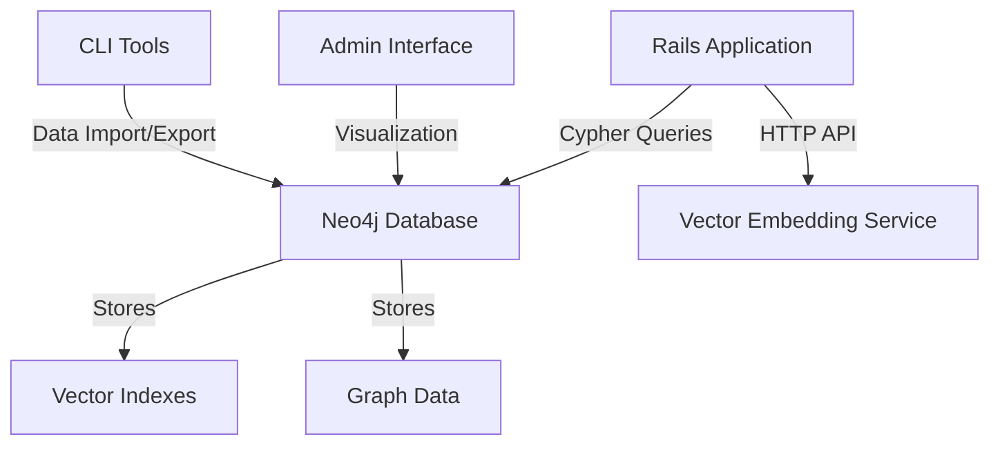

# Neo4j Vector Graph Database Proof of Concept

## Overview

This document outlines the implementation of a Neo4j-based knowledge graph with vector embedding support, serving as a comparison to our existing Weaviate implementation. The goal is to leverage Neo4j's native graph capabilities to create more expressive relationships between entities while maintaining vector search functionality.

## Objectives

1. Set up Neo4j with vector search capabilities
2. Import existing seed data with rich relationship types
3. Implement vector embeddings for semantic search
4. Create visualization tools for graph exploration
5. Compare with Weaviate implementation

## Technical Stack

- **Database**: Neo4j 5.13+ Enterprise Edition (for vector search)
- **Vector Model**: All-MiniLM-L6-v2 (same as Weaviate for fair comparison)
- **Backend**: Ruby on Rails with `neo4j-ruby-driver`
- **Visualization**: Neo4j Bloom and custom D3.js visualization
- **Vector Processing**: ONNX Runtime for local embedding generation

## Architecture



## Setup Instructions

### 1. Install Neo4j with Docker

```yaml
# docker-compose.yml
version: '3.8'

services:
  neo4j:
    image: neo4j:5.13-enterprise
    container_name: neo4j
    environment:
      - NEO4J_AUTH=neo4j/your_secure_password
      - NEO4J_dbms_memory_pagecache_size=2G
      - NEO4J_dbms_memory_heap_initial__size=4G
      - NEO4J_dbms_memory_heap_max__size=4G
      - NEO4J_dbms_security_procedures_unrestricted=apoc.*,gds.*,embedding.*
      - NEO4J_apoc_export_file_enabled=true
      - NEO4J_apoc_import_file_enabled=true
      - NEO4J_apoc_import_file_use__neo4j__config=true
      - NEO4JLABS_PLUGINS='["apoc", "graph-data-science"]'
    ports:
      - "7474:7474"   # Browser UI
      - "7687:7687"   # Bolt protocol
      - "7473:7473"   # HTTPS
    volumes:
      - neo4j_data:/data
      - neo4j_logs:/logs
      - neo4j_import:/var/lib/neo4j/import
    healthcheck:
      test: ["CMD", "cypher-shell", "--username", "neo4j", "--password", "your_secure_password", "RETURN 1"]
      interval: 10s
      timeout: 5s
      retries: 5

volumes:
  neo4j_data:
  neo4j_logs:
  neo4j_import:
```

### 2. Install Dependencies

Add to Gemfile:

```ruby
gem 'neo4j-ruby-driver'
gem 'onnxruntime', '~> 0.5.0'
gem 'tokenizers', '~> 0.4.2'
```

### 3. Initialize Neo4j Service

Create `app/services/neo4j_service.rb`:

```ruby
class Neo4jService
  def initialize
    @driver = Neo4j::Driver::GraphDatabase.driver(
      'bolt://localhost:7687',
      Neo4j::Driver::AuthTokens.basic('neo4j', ENV['NEO4J_PASSWORD'])
    )
  end

  def session(&block)
    @driver.session(&block)
  end
  
  def close
    @driver&.close
  end
end
```

## Data Model

### Node Labels

- `Person`: People in the system
- `Pet`: Animals with owner relationships
- `Document`: Text content with embeddings
- `Project`: Projects that people work on
- `Vehicle`: Vehicles with owner relationships
- `List`: Collections of items
- `ListItem`: Individual items in a list

### Relationship Types

- `OWNS_PET`
- `OWNS_VEHICLE`
- `AUTHORED_BY`
- `WORKED_ON`
- `MENTIONED_IN`
- `RELATED_TO` (with `type` property)
- `TAGGED_WITH` (for categorization)
- `SIMILAR_TO` (vector similarity)

## Implementation Phases

### Phase 1: Setup and Basic Import

1. **Docker Compose Setup**
   - Configure Neo4j with APOC and GDS
   - Set up proper volume mounts
   - Configure authentication

2. **Data Import**
   - Create Cypher scripts to import YAML fixtures
   - Handle relationships with properties
   - Set up constraints and indexes

### Phase 2: Vector Integration

1. **Embedding Service**
   - Create a service to generate embeddings using ONNX
   - Batch process text fields
   - Store embeddings as node properties

2. **Vector Index**
   - Create vector indexes for similarity search
   - Implement k-NN search queries

### Phase 3: Visualization

1. **Neo4j Bloom**
   - Configure perspectives
   - Create search phrases
   - Style nodes and relationships

2. **Custom D3.js Visualization**
   - Interactive force-directed graph
   - Filter by node/relationship types
   - Display node/relationship properties

## Example Queries

### Find Similar Documents

```cypher
MATCH (d:Document)
CALL db.index.vector.queryNodes('document-embeddings', 5, d.embedding)
YIELD node AS similarDoc, score
WHERE d <> similarDoc
RETURN d.title, similarDoc.title, score
ORDER BY score DESC
LIMIT 10
```

### Get Person's Network

```cypher
MATCH (p:Person {name: 'Winnie the Pooh'})-[:OWNS_PET|OWNS_VEHICLE|WORKED_ON|AUTHORED_BY*1..3]-(related)
RETURN p, related
```

## Comparison with Weaviate

| Feature | Neo4j | Weaviate |
|---------|-------|-----------|
| Native Graph Model | ✅ First-class support | ❌ Simulated |
| Relationship Properties | ✅ Native support | ❌ Requires workarounds |
| Vector Search | ✅ Plugin-based | ✅ Built-in |
| Query Language | Cypher | GraphQL + custom |
| Schema Flexibility | ✅ Schema-optional | ✅ Schema-optional |
| Performance | Optimized for graph traversals | Optimized for vector search |
| Visualization | Built-in tools | Requires custom implementation |

## Development Tasks

1. [ ] Set up Neo4j with Docker Compose
2. [ ] Create data import scripts
3. [ ] Implement embedding service
4. [ ] Set up vector indexes
5. [ ] Create visualization components
6. [ ] Write comparison benchmarks
7. [ ] Document API endpoints
8. [ ] Create example queries

## Testing Strategy

1. **Unit Tests**
   - Test individual service methods
   - Verify embedding generation

2. **Integration Tests**
   - Test data import/export
   - Verify graph structure

3. **Performance Tests**
   - Compare query performance with Weaviate
   - Measure import/export times

## Deployment

1. **Development**
   - Local Docker Compose setup
   - Sample data included

2. **Production**
   - Managed Neo4j AuraDB or self-hosted
   - Horizontal scaling for read replicas
   - Backup and monitoring setup

## Future Enhancements

1. **Multi-modal Support**
   - Image embeddings
   - Audio content

2. **Advanced Analytics**
   - Graph algorithms
   - Community detection
   - Centrality analysis

3. **Real-time Updates**
   - Stream processing
   - Live visualization updates

## Conclusion

This implementation will provide a robust comparison between Neo4j's property graph model with vector extensions and Weaviate's vector-native approach. The richer relationship model in Neo4j may provide more expressive queries and better modeling of complex domains.